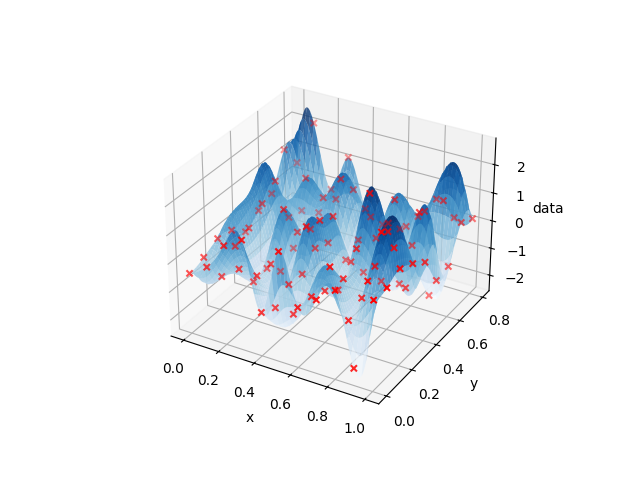
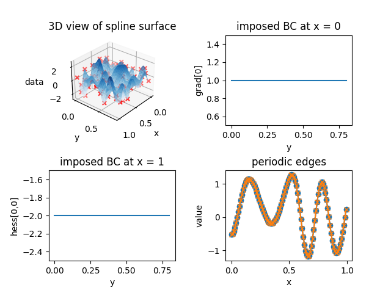

# cubicmultispline
Library for cubic, **multivariate spline interpolation** from samples with **arbitrary boundary conditions for each dimension**.

## Contents

- [Overview](#overview)
- [Installation](#installation)
- [Usage](#usage)
    - [Data preparation](#data-preparation)
    - [Spline generation and inspection](#spline-generation-and-inspection)
- [Further examples](#further-examples)
- [License](#license)

## Overview
This library implements the recursive algorithm by [Habermann and Kindermann](https://link.springer.com/article/10.1007/s10614-007-9092-4) in the `Spline` class. The 1-dimensional base case, which is needed during recursion is implemented in the `Spline1D` class. In contrast to other multivariate spline implementations, this library allows for arbitrary boundary conditions for each dimension, that is
1. not-a-knot
2. first order (clamped)
3. second order (natural)
4. periodic 

Additionally, the library provides an efficient function `eval_spline` to evaluate the spline at arbitrary points inside the domain.

## Installation

The easiest way to install the library is to use `pip`:

```bash
pip install cubicmultispline
```

Alternatively, you can install the library from source:

```bash
python setup.py install
```

## Usage

This section serves as quick demo how to use the library. The presented example can be found in the [tests](tests) directory inside [demo_not-a-knot.py](tests/demo_not-a-knot.py).

### Data preparation
First, we need to prepare the data. In this example, we assume 2-dimensional sample values on a regular grid. The grid must be equidistant in each dimension. However, the grid spacing may differ between dimensions. 

```python
# shape of the data -> number of points in each dimension 
shape = (11, 9)

# ranges of the data -> [min, max] for each dimension       
ranges = [ 
    [0, 1],
    [0, 0.8],
    ]

# interval tuple for each dimension -> (min, max, number of points) for each dimension
interval = tuple(
    (ranges[i][0], 
    ranges[i][1], 
    shape[i]) for i in range(len(shape))
    )

# boundary conditions for each dimension -> (first condition, second condition) for each dimension
bc = (
    ("not-a-knot", "not-a-knot"), 
    ("not-a-knot", "not-a-knot"),
    )

# boundary conditions values for each dimension -> (first condition value, second condition value) for each dimension
# for "not-a-knot" and "periodic" boundary conditions, the values are not used
bc_value = (
    (0.0, 0.0), 
    (0.0, 0.0),
    )

# generation of random dummy data
dummy_data = np.random.randn(*shape).ravel()
```

It is important, that the sample data is **always** a 1-dimensional array of length `np.prod(shape)`. You can convert any multidimensional array using `ravel()`. This makes sure that the values are sorted correctly regarding the dimensions (first dimension changes slowest, last dimension changes fastest). 

### Spline generation and inspection

Next, the spline surface can be created:

```python
# generation of spline - in this case a 2D surface
spline_2d = spl.Spline(interval, dummy_data, bc, bc_value)
```

Note, that the sample positions are not passed explicitly. Instead, the interval tuple carries all necessary information. In order to compare the generated spline to the sample data, we can evaluate the spline at the sample positions. To this end, the sample positions are generated using `np.meshgrid`:

```python
# Locations of dummy_data samples
x_sample = np.linspace(ranges[0][0], ranges[0][1], shape[0])
y_sample = np.linspace(ranges[1][0], ranges[1][1], shape[1])
x_sample, y_sample = np.meshgrid(x_sample, y_sample, indexing='ij')
```

The spline can be evaluated at any point in the domain using the `eval_spline` method. To achieve a smooth surface, we evaluate the spline at a finer grid:

```python
# Locations of spline evaluations for smooth surface
x_spline_eval = np.linspace(ranges[0][0], ranges[0][1], shape[0]*50)
y_spline_eval = np.linspace(ranges[1][0], ranges[1][1], shape[1]*50)
x_spline_eval, y_spline_eval = np.meshgrid(x_spline_eval, y_spline_eval, indexing='ij')
```
The `eval_spline` method returns the spline values, the gradient and the hessian for each point. In this example, we only need the spline values `vals`:
 ```python
# Spline evaluation
coords = np.concatenate((
    x_spline_eval.reshape((-1,1)), 
    y_spline_eval.reshape((-1,1))
    ), axis = 1)
vals, dvals, ddvals = spline_2d.eval_spline(coords)
vals = vals.reshape(x_spline_eval.shape)
```
The resulting spline values are reshaped to match the shape of the evaluation grid for plotting purposes. Finally, we can plot the spline surface and the sample data:

```python
# Plot dummy data and spline surface
fig = plt.figure()
ax = fig.add_subplot(111, projection='3d')
ax.plot_surface(x_spline_eval, y_spline_eval, vals, antialiased = True, alpha = 0.8, cmap = cm.Blues)
ax.scatter(x_sample, y_sample, dummy_data.reshape(x_sample.shape), c = "red", marker = 'x')

ax.set_xlabel('x')
ax.set_ylabel('y')
ax.set_zlabel('data')
plt.show()
```
The resulting plot should look similar - not identical due to random data - to the following. The red crosses mark the sample positions.


## Further examples

The library provides two additional examples in the [tests](tests) directory:
1. [demo_first-second-peri.py](tests/demo_first-second-peri.py): 2D spline with clamped and natural boundary conditions in the x-direction and periodicity in the y-direction
2. [demo_first-second-3d.py](tests/demo_first-second-3d.py): 3D spline with first and second order boundary conditions

In the following, the 2-dimensional case is discussed in detail. The data is prepared in the same manner as before. However, the boundary conditions are different. In this case, we use clamped and natural boundary conditions in the x-direction and periodicity in the y-direction: 

```python
bc = (
    ("first_derivative", "second_derivative"), 
    ("periodic", "periodic"),
    )
```

The following values are used:

```python
bc_value = (
    (1.0, -2.0), 
    (0.0, 0.0),
    )
```

Note, that in case of a periodic boundary constraint, both edges of the domain are periodic. This is checked inside `Spline1D` and corrected if necessary, i.e., all values inside the tuple of the corresponding dimension are set to `"periodic"`. The boundary condition values are not of any meaning in this case.

In addition to the differing boundary conditions, the dummy data has to be periodic in the dimension where periodicity is imposed. This is done by setting the first and last value of the dummy data to be equal:

```python
dummy_data[:, 0] = dummy_data[:, -1]
```

The `Spline1D` class raises an error if the dummy data is not periodic. The resulting spline surface should look similar to the following:


In addition to the 3-dimensional view of the spline surface, the boundary conditions are checked by inspecting the gradient and hessian at the edges of the domain. The partial derivative w.r.t. the x-axis at the left edge should be equal to the first boundary condition value, and the second order partial derivative w.r.t. the x-axis (twice) at the right edge should be equal to the second boundary condition value. This is indeed the case. The periodic edges are inspected by means of the values at the left and right edge of the domain - they are equal as required by periodicity. The first and second derivative along the y-direction (normal to the periodic edges) are checked separately: 

```python
# checking first and second derivative along periodic edges
dy_vals = dvals[:, 1].reshape(x_spline_eval_grid.shape)
ddy_vals = ddvals[:, 1, 1].reshape(x_spline_eval_grid.shape)

assert np.allclose(dy_vals[:, 0], dy_vals[:, -1])
assert np.allclose(ddy_vals[:, 0], ddy_vals[:, -1])
```

## License

This library is licensed under the MIT License - see the [LICENSE](LICENSE) file for details.
