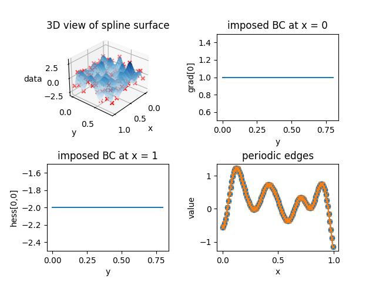

.. _boundary2d:

2D example -- scalar field
=================================

Besides the generation of splines of arbitrary dimension, another core feature of this library is the support for various boundary conditions in different dimensions.

.. The library provides two additional examples in the ``tests/demos`` directory:

.. 1. ``demo_first-second-peri.py``: 2D spline with clamped and natural boundary conditions in the x-direction and periodicity in the y-direction
.. 2. ``demo_first-second-3d.py``: 3D spline with first and second order boundary conditions

In the following, a 2-dimensional case is discussed in detail. The data is prepared in the same manner as before. However, the boundary conditions are different. In this case, we use clamped and natural boundary conditions in the :math:`x`-direction at :math:`x=0` and  :math:`x=1`, respectively, and periodicity in the :math:`y`-direction: 

.. literalinclude:: ../../tests/demos/demo_first-second-peri.py
   :start-after: #1s
   :end-before: #1e

The following values are specified:

.. literalinclude:: ../../tests/demos/demo_first-second-peri.py
   :start-after: #2s
   :end-before: #2e

.. note::

    In case of a periodic boundary constraint, both edges of the domain are periodic. This is checked inside :py:class:`~cubicmultispline.Spline1D` and corrected if necessary, i.e., all values inside the tuple of the corresponding dimension are set to ``"periodic"``. **The boundary condition values are not of any meaning in this case**.

In addition to the differing boundary conditions, the dummy data has to be periodic in the dimension where periodicity is imposed. This is done by setting the first and last value of the dummy data to be equal:

.. literalinclude:: ../../tests/demos/demo_first-second-peri.py
   :start-after: #3s
   :end-before: #3e

The :py:class:`~cubicmultispline.Spline1D` class raises an error if the dummy data is not periodic. The resulting spline surface should look similar to the following:

In addition to the 3-dimensional view of the spline surface, the boundary conditions are checked by inspecting the gradient and Hessian along the edges of the domain. The partial derivative w.r.t. the :math:`x`-axis :math:`\partial f/\partial x` along the left edge :math:`x\equiv 0 \cap y \in [0, 0.8]` should be equal to the first boundary condition value, and the second order partial derivative w.r.t. the :math:`x`-axis :math:`\partial^2 f/\partial x^2` along the right edge :math:`x\equiv 1 \cap y \in [0, 0.8]` should be equal to the second boundary condition value. This is indeed the case. 

The periodic edges :math:`y = \lbrace 0, 0.8 \rbrace \cap x \in [0, 1]` are inspected by means of the values along the left and right edge of the domain -- they are equal as required by periodicity. The first and second derivative along the :math:`y`-direction (normal to the periodic edges) are checked separately: 

.. literalinclude:: ../../tests/demos/demo_first-second-peri.py
   :start-after: #4s
   :end-before: #4e
