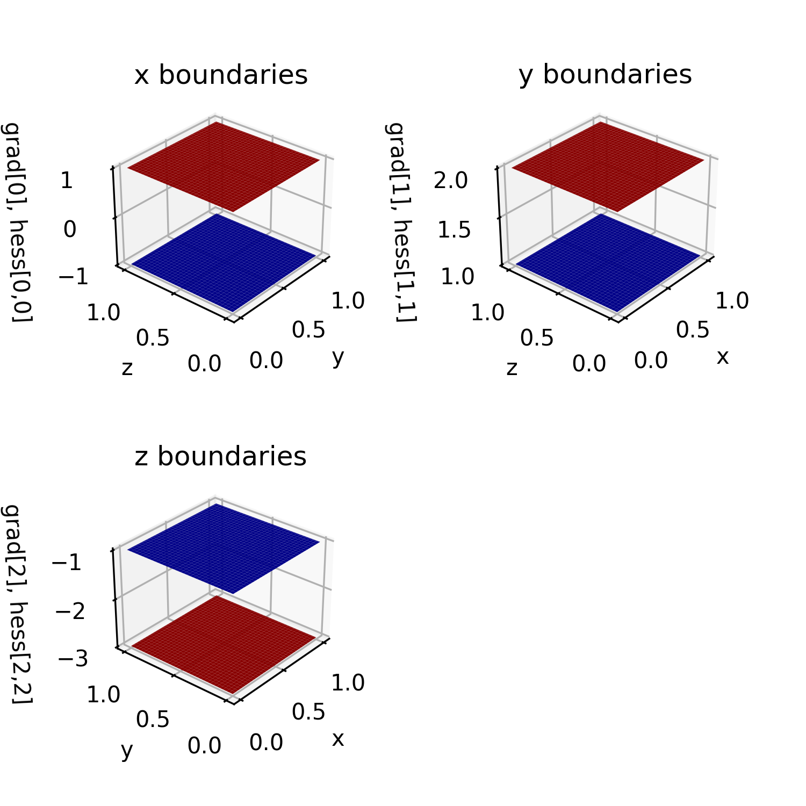

.. _boundary3d:

3D example -- scalar field
==========================

As soon as a 3-dimensional field is interpolated, visualization is not straightforward anymore. They typically occur in mechanics as for example in stress, strain or displacement fields. While the former fields are represented by higher order tensors, this example interpolates a scalar, random field using clamped and natural boundary conditions in each dimension. The extension to tensor fields is achieved by employing a multidimensional spline interpolation for each field coordinate. 

Preparation
-----------------

The 3-dimensional example is constructed in a unit cube domain and uses the following boundary conditions: 

.. literalinclude:: ../../tests/demo_first-second-3d.py
   :start-after: #1s
   :end-before: #1e

The values are arbitrarily chosen, yet, different from each other to verify that they are applied in the correct dimension. The data preparation and spline evaluation is analog to the :ref:`quickstart case <quickstart-data>`.

Boundary condition verification
-------------------------------

The imposed boundary conditions are verified by inspecting each of the six sides of the unit cube and plotting the first and second derivative as specified. The code for preparing the :math:`x`-direction plots reads

.. literalinclude:: ../../tests/demo_first-second-3d.py
   :start-after: #2s
   :end-before: #2e

The remaining sides are inspected similarly. The following image shows surface plots for :math:`x=0` (blue) and :math:`x=1` (red) of the partial derivatives. A comparison to the specified values above shows that all values are met. 

Volumetric swipe
-------------------

A volumetric comparison of the spline evaluation to the original sample data is achieved as follows. The spline is evaluated on a :math:`101^3` grid, while the samples are given on a :math:`11^3` grid. Since the grid numbers include start and end point, every 10th point on the evaluation grid shares the same location as a original sample. The code snipped reads as follows: 

.. literalinclude:: ../../tests/demo_first-second-3d.py
   :dedent:
   :start-after: #3s
   :end-before:  #3e

Since it is placed inside a loop which exports 101 slices, the assertion is not done at once for 3-dimensional data but every 10th iteration for a 2-dimensional slice.

Finally, each slice along the :math:`z`-direction can be exported and compiled inside a single gif. The following animation shows the volumetric spline interpolation slice by slice.

.. image:: ../_static/demo_gifs/slices.gif
   :alt: slices
   :align: center
