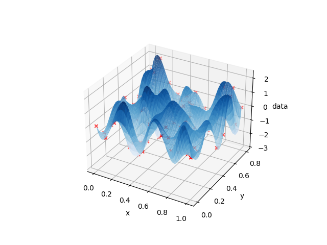

Quickstart
=============

This section serves as quick demo how to use the library. The presented example can be found in the tests directory of the `repository`_ inside :code:`demo_not-a-knot.py`.

.. _repository: https://https://github.com/a118145/cubic-multivar-spline/

Data preparation
--------------------

First, we need to prepare the data. In this example, we assume 2-dimensional sample values on a regular grid. The grid must be equidistant in each dimension. However, the grid spacing may differ between dimensions. 

.. literalinclude:: ../../tests/demo_not-a-knot.py
   :start-after: #1s
   :end-before: #1e

.. important::

   It is important, that the sample data is **always** a 1-dimensional array of length :code:`np.prod(shape)`. You can convert any multidimensional array using :code:`ravel()`. This makes sure that the values are sorted correctly regarding the dimensions (first dimension changes slowest, last dimension changes fastest). 

Spline generation and inspection
--------------------------------

Next, the spline surface can be created:

.. literalinclude:: ../../tests/demo_not-a-knot.py
   :start-after: #2s
   :end-before: #2e

.. note::

   The sample positions are not passed explicitly. Instead, the interval tuple carries all necessary information. 

In order to compare the generated spline to the sample data, we can evaluate the spline at the sample positions. To this end, the sample positions are generated using :code:`np.meshgrid`:

.. literalinclude:: ../../tests/demo_not-a-knot.py
   :start-after: #3s
   :end-before: #3e

The spline can be evaluated at any point in the domain using the :py:meth:`~cubicmultispline.Spline.eval_spline` method. To achieve a smooth surface, we evaluate the spline at a finer grid:

.. literalinclude:: ../../tests/demo_not-a-knot.py
   :start-after: #4s
   :end-before: #4e

The :py:meth:`~cubicmultispline.Spline.eval_spline` method returns the spline values, the gradient and the hessian for each point. In this example, we only need the spline values :code:`vals`:

.. literalinclude:: ../../tests/demo_not-a-knot.py
   :start-after: #5s
   :end-before: #5e

The resulting spline values are reshaped to match the shape of the evaluation grid for plotting purposes. Finally, we can plot the spline surface and the sample data:

.. literalinclude:: ../../tests/demo_not-a-knot.py
   :start-after: #6s
   :end-before: #6e
   :append: plt.show()

The resulting plot should look similar -- not identical due to random data -- to the following. The red crosses mark the random sample values.

More complex cases, which also discuss different boundary conditions, are found on the following pages. 
